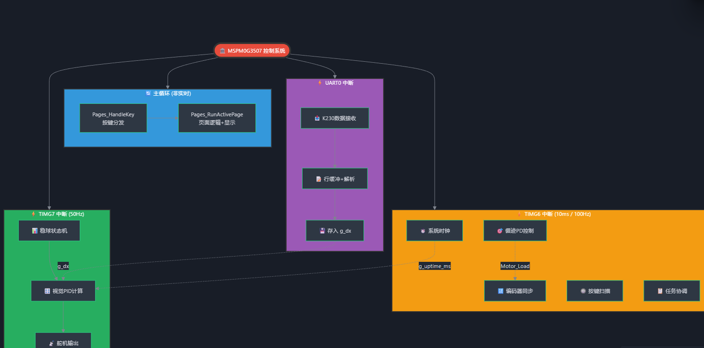

# 车载平衡滚球运动控制系统 H 题

> 2026 年全国大学生电子设计竞赛 H 题完整实现方案。

## 📋 项目简介

本项目是 **2026 年电赛 H 题「车载平衡滚球运动控制系统」** 的车载主控端代码，运行在 **TI MSPM0G3507**（天猛星 3507 开发板）上，配合 **K230 视觉模块** 实现小车循迹、钢球平衡、动态稳球等复合控制任务。

系统核心采用**三中断分层架构**：
- **实时任务**（循迹、按键、任务协调）放在 10ms 定时器中断
- **视觉 PID 计算**放在 50Hz 定时器中断
- **串口接收**放在 UART 中断
- **非实时任务**（菜单、显示）放在主循环

模块间通过 Tick 函数解耦，**主文件仅 60 行**。

## ✨ 核心功能

- 🚗 **5 路红外循迹**（PD 控制 + 三阶段精准停车）
- 📷 **K230 视觉接收**（UART 115200，`dx=±XXX` 协议）
- ⚖️ **钢球位置闭环 PID 控制**（舵机 50Hz 调节）
- 📋 **6 任务统一调度**（表驱动配置，一键启动）
- 🖥️ **OLED 菜单系统**（5 页面表驱动切换）
- 🔒 **全局 volatile + 临界区保护**（并发安全）

## 🛠️ 技术栈

- **主控芯片**：TI MSPM0G3507（Cortex-M0+，80MHz）
- **视觉模块**：K230（嘉楠科技，双核 RISC-V）
- **开发环境**：Code Composer Studio (CCS) 12.6+ 或 Theia 1.x
- **SDK**：MSPM0G3507 SDK v2.01+
- **编译器**：TI Clang for ARM
- **调试器**：XDS110（板载）或 J-Link

## 📐 软件架构

### 整体架构：三中断分层 + 双表驱动

**三中断分层：**
1. **10ms 定时器中断**：循迹控制、按键扫描、任务状态机
2. **50Hz 定时器中断**：视觉数据处理、PID 计算、舵机输出
3. **UART 中断**：K230 视觉数据接收（非阻塞）

**双表驱动设计：**
1. **页面表**（`pages.c`）：`s_page_table[5]` 存储每页的 `on_key` / `on_run` / `on_leave` 函数指针，新增页面只需表里加 1 行
2. **任务配置表**（`task_manager.c`）：`s_task_cfg[7]` 封装每任务的循迹使能、稳球使能、车速、目标序列



## 📁 项目结构

```
chezaipinghenggunqiuyundongkongzhixitong/
├── main.c                      # 主程序入口（60 行）
├── sys/
│   ├── system.c/h              # 系统初始化、中断配置
│   └── clock.c/h               # 时钟配置
├── driver/
│   ├── motor.c/h               # 电机驱动（PWM）
│   ├── infrared.c/h            # 红外传感器（ADC）
│   ├── servo.c/h               # 舵机控制（PWM）
│   ├── oled.c/h                # OLED 显示（I2C）
│   └── uart_k230.c/h           # K230 视觉串口
├── app/
│   ├── track.c/h               # 循迹控制（PD 控制器）
│   ├── vision_pid.c/h          # 视觉 PID（稳球控制）
│   ├── pages.c/h               # 页面表驱动
│   ├── task_manager.c/h        # 任务配置表
│   └── menu.c/h                # 菜单逻辑
└── SDK/                        # MSPM0 SDK 库文件
```

## 🚀 使用说明

### 开发环境配置

1. 安装 **Code Composer Studio (CCS) 12.6+**（TI 官方 IDE）
2. 下载 **MSPM0G3507 SDK v2.01+**（[TI 官网](https://www.ti.com.cn/tool/cn/MSPM0-SDK)）
3. 连接 **XDS110 调试器**到天猛星开发板

### 编译与下载

1. 在 CCS 中打开本工程
2. 配置 SDK 路径（Project Properties → Resource → Linked Resources）
3. 点击「Build Project」编译
4. 点击「Debug」下载并运行

### 参数调节

核心参数在 `app/config.h` 中配置：

- **循迹 PD 参数**：`TRACK_KP`、`TRACK_KD`
- **视觉 PID 参数**：`VISION_KP`、`VISION_KI`、`VISION_KD`
- **车速设定**：`SPEED_TASK_1` ~ `SPEED_TASK_6`
- **停车精度**：`STOP_THRESHOLD`（编码器脉冲数）

### OLED 菜单操作

- **按键 1（上）**：上翻页面
- **按键 2（确认）**：选择当前项/启动任务
- **按键 3（下）**：下翻页面

**5 个页面：**
1. 主页（显示当前状态）
2. 任务选择（6 个预设任务）
3. 参数调节（PID/速度）
4. 系统信息（电池电压/版本号）
5. 调试模式（实时数据）

## 📊 任务配置示例

| 任务 | 循迹 | 稳球 | 车速 | 目标序列 |
|------|------|------|------|----------|
| 任务 1 | ✓ | ✗ | 50% | 直行 5m |
| 任务 2 | ✓ | ✓ | 40% | 直行 3m → 稳球 10s |
| 任务 3 | ✓ | ✓ | 60% | 循环赛道 + 动态稳球 |

## 🏆 竞赛成绩

- **2026 年全国大学生电子设计竞赛 H 题**：完成全部基本要求 + 发挥部分

## 🤝 参与贡献

1. **槐序**（Sherlock Holmes）  
2. **拾忆**  
3. **哦哦**（いずみ さぎり）

欢迎 Fork 本仓库并提交改进方案。

## 📝 参考资料

- TI MSPM0G3507 官方文档：[TI MSPM0 系列](https://www.ti.com.cn/microcontrollers-mcus-processors/arm-based-microcontrollers/arm-cortex-m0-mcus/mspm0-portfolio/overview.html)
- 电赛官网：[全国大学生电子设计竞赛](http://www.nuedc.com.cn/)

---

**开发者**：xiazhuo  
**团队成员**：槐序、拾忆、哦哦
